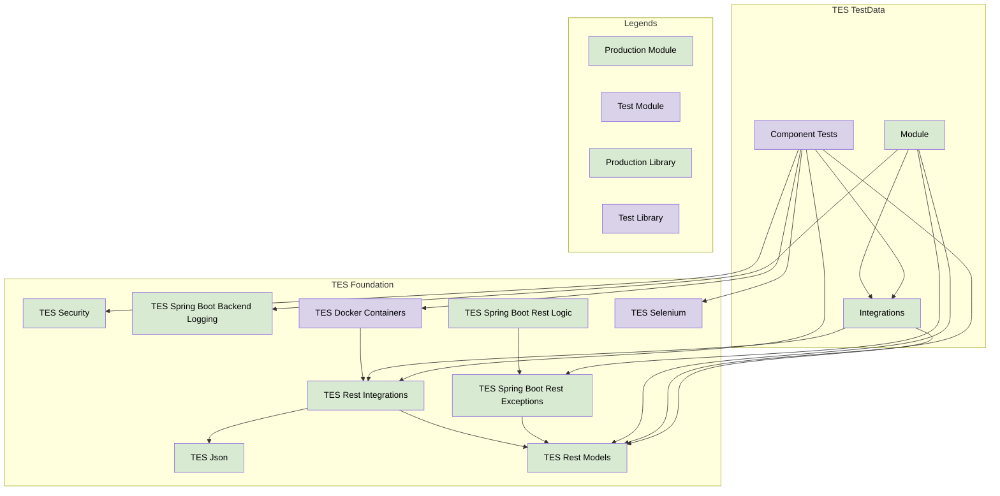

# Dependencies

## TEL TestData Module

```mermaid
flowchart
    subgraph "TES Foundation"
        tesJson["TES Json"]:::prodLibrary
        tesRestModels["TES Rest Models"]:::prodLibrary
        tesSecurity["TES Security"]:::prodLibrary
        tesSpringBootLogging["TES Spring Boot Backend Logging"]:::prodLibrary
        tesRestIntegrations["TES Rest Integrations"]:::prodLibrary --> tesJson
        tesRestIntegrations:::prodLibrary --> tesRestModels
        tesSpringBootRestExceptions["TES Spring Boot Rest Exceptions"]:::prodLibrary --> tesRestModels
        tesSpringBootRestLogic["TES Spring Boot Rest Logic"]:::prodLibrary --> tesSpringBootRestExceptions

        tesDockerContainers["TES Docker Containers"]:::testLibrary --> tesRestIntegrations
        tesSelenium["TES Selenium"]:::testLibrary
    end

    subgraph "TES TestData"
        telTestDataModule["Module"]:::prodModule --> telTestDataIntegrations
        telTestDataModule --> tesSpringBootLogging
        telTestDataModule --> tesRestModels
        telTestDataModule --> tesSpringBootRestExceptions

        telTestDataIntegrations["Integrations"]:::prodModule --> tesRestModels
        telTestDataIntegrations --> tesRestIntegrations

        telTestDataComponentTests["Component Tests"]:::testModule --> telTestDataIntegrations
        telTestDataComponentTests --> tesRestModels
        telTestDataComponentTests --> tesRestIntegrations       
        telTestDataComponentTests --> tesDockerContainers
        telTestDataComponentTests --> tesSecurity
        telTestDataComponentTests --> tesSelenium
    end

    subgraph "Legends"
        legProdModule["Production Module"]:::prodModule
        legTestModule["Test Module"]:::testModule
        legProdLib["Production Library"]:::prodLibrary
        legTestLib["Test Library"]:::testLibrary
    end

    classDef prodModule fill:#d9ead3,color:#000
    classDef testModule fill:#d9d2e9,color:#000
    classDef prodLibrary fill:#d9ead3,color:#000
    classDef testLibrary fill:#d9d2e9,color:#000
```
