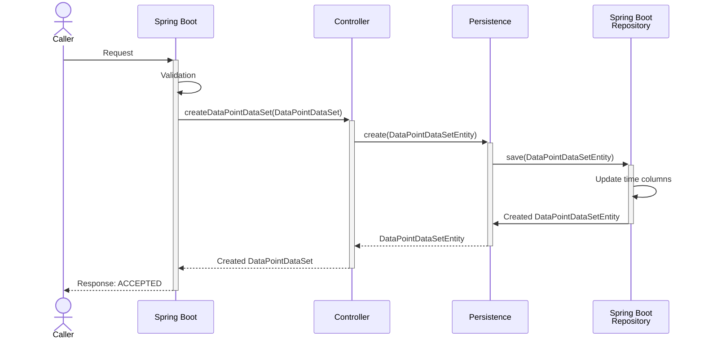

# Design of endpoints

### Data model

Data models for the endpoints are documented in with OpenApi that is accessible by the `tel-testdata` 
service. The documentation can be accessed here:

```
https://<host>:<port>/swagger-ui.html
```

## Data points

Data points are test data of pair of X- and Y-coordinates.


### Create data sets of data points

Data set of data points can be created like with this endpoint:

```
POST /datasets/data-points
```

Creation of a dataset of data points are done like this:


